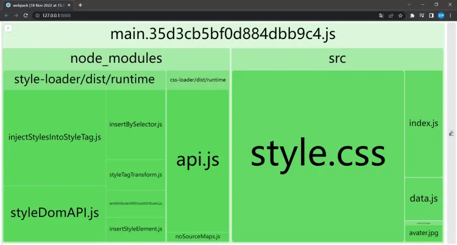

# 前端工程化之 Webpack

打包工具的出现，解决了浏览器的兼容问题，以及避免模块过多等问题。

> At its core, webpack is a static module bundler for modern JavaScript applications. When webpack processes your application, it internally builds a dependency graph from one or more entry points and then combines every module your project needs into one or more bundles, which are static assets to serve your content from.

> 本质上，webpack 是一个用于现代 JavaScript 应用程序的 静态模块打包工具。当 webpack 处理应用程序时，它会在内部从一个或多个入口点构建一个 依赖图(dependency graph)，然后将你项目中所需的每一个模块组合成一个或多个 bundles，它们均为静态资源，用于展示你的内容。

[Webpack 官网 👉](https://webpack.js.org/)

## 相关依赖

```sh
# webpack 核心文件
# webpack-cli 命令行工具
npm install -D webpack webpack-cli
```

```json
// package.json
// 本地配置配置 webpack 项目时候
// 未配置 build: webpack 时，打包使用 npm run webpack 命令
// 配置后，可使用 npm run build 命令
{
  "name": "",
  "version": "1.0.0",
  "main": "index.js",
  "license": "MIT",
  "devDependencies": {
    "webpack": "^5.75.0",
    "webpack-cli": "^5.0.0" // 必须，否则无法 npm run webpack
  },
  "scripts": {
    "build": "webpack" // [!code ++]
  },
  "dependencies": {
    "jquery": "^3.6.1"
  }
}
```

## 配置文件

```js
/* webpack.config.js */
module.exports = {
  mode: "production", // 设置打包模式 development 开发环境 | production 生产环境
};
```

## entry

入口点指示 webpack 应该使用哪个模块来开始构建其内部依赖关系图。Webpack 将计算出入口点（直接和间接）依赖于哪些其他模块和库。

```js
/* webpack.config.js */
module.exports = {
  mode: "production",

  // 1. 单个入口文件【默认】 // [!code ++]
  entry: "./src/index.js", // [!code ++]

  // 2. 单个入口文件 // [!code ++]
  // 重新指定入口文件为 hello.js // [!code ++]
  entry: "./hello/hello.js", // [!code ++]

  // 3. 多个入口文件【数组】 // [!code ++]
  // 会打包合并成一个文件，且打包后的文件名以 main.js 命名 // [!code ++]
  entry: ["./src/a.js", "./src/b.js"], // [!code ++]

  // 4. 多个入口文件【对象】 // [!code ++]
  // 会以属性名作为打包后的文件名，将对应文件进行打包 // [!code ++]
  // 如 index.js 会打包为 main.js // [!code ++]
  // 如 sub.js 会打包为 sub.js // [!code ++]
  entry: {
    main: "./src/index.js", // [!code ++]
    sub: "./src/sub.js", // [!code ++]
  },
};
```

::: tip
软件设计思想：约定优于配置
:::

## output

输出属性告诉 webpack 在哪里发出它创建的捆绑包以及如何命名这些文件。默认为/用于主输出文件的 dist/main.js 和/任何其他生成文件的 dist 文件夹。

### 配置

```js
/* webpack.config.js */
const path = require("path");

module.exports = {
  mode: "production",

  // 配置打包后的文件地址、信息
  output: {
    // 1. 打包后“目录”，必须为绝对路径 // [!code ++]
    // 默认 path.resolve(__dirname, "dist")，表示为项目根路径下的 dist 目录 // [!code ++]
    path: path.resolve(__dirname, "dist"), // [!code ++]

    // 2. 打包后“文件名” // [!code ++]
    // 默认 main.js // [!code ++]
    filename: "bundle.js", // [!code ++]

    // 3. 打包前清空 path 配置的目录 // [!code ++]
    // 默认 false // [!code ++]
    clean: true, // [!code ++]
  },
};
```

### 多入口文件

```js
/* webpack.config.js */
const path = require("path");

module.exports = {
  mode: "production",

  entry: {
    main: "./src/index.js",
    sub: "./src/sub.js",
  },

  output: {
    path: path.resolve(__dirname, "dist"),

    // filename: "[name]-[id].js", // 会生成一个 main-id.js 值 // [!code ++]
    // filename: "[name]-[hash].js", // 会生成一个 main-hash.js 值 // [!code ++]
    // 文件名加入 id / hash 值，可以作为版本的参考依据。 // [!code ++]
    filename: "[name].js", // [!code ++]

    clear: true,
  },
};
```

Multiple Entry Points · 多个入口点

If your configuration creates more than a single "chunk" (as with multiple entry points or when using plugins like CommonsChunkPlugin), you should use [substitutions](https://webpack.js.org/configuration/output/#outputfilename) to ensure that each file has a unique name.

如果您的配置创建的不仅仅是单个“块”（如多个入口点或使用 CommonsChunkPlugin 等插件时），则应使用替换来确保每个文件具有唯一的名称。

更多相关配置，可前往 [Webpack output filename 👉](https://webpack.js.org/configuration/output/#outputfilename)

::: warning
避免浏览器缓存 js 文件

由于现在每次生成的文件名都是 dist.js，所以浏览器会对这个文件进行缓存，进而不更新。为了避免进行缓存，可以给文件名添加一段随机的字符，每次更新后都生成新的随机字符，所以在 webpack.config.js 中配置输出即可

```js
/* webpack.config.js */
module.exports = {
  mode: "production",

  output: {
    filename: "[name].[contenthash].js",
    path: path.resolve(__dirname, "dist"),
  },
};
```

:::

## loader

加载程序是应用于模块源代码的转换。它们允许您在导入或“加载”它们时预处理文件。因此，装载机就像其他构建工具中的“任务”一样，并提供了一种处理前端构建步骤的强大方法。加载程序可以将文件从其他语言（例如 TypeScript）转换为 JavaScript 或将内联图像加载为数据 URL。装载机甚至允许您直接从 JavaScript 模块中进行导入 CSS 文件之类的事情！

> npm webpack 默认情况下，只会处理 js 文件，其它文件需要使用 loader 加载器。

### 安装

```sh
# 安装 loader
# css-loader 负责解析 css 文件
# style-loader 负责将解析后的 css 文件，插入到 html 文件中
npm install -D css-loader style-loader
```

### 配置

```js
/* webpack.config.js */
module.exports = {
  mode: "production",

  module: {
    rules: [
      {
        test: /\.css$/i, // 匹配以 .css 结尾的文件 // [!code ++]
        // 匹配到以 .css 结尾的文件，使用 style-loader 和 css-loader 进行处理 // [!code ++]
        // 注意：这里是先执行了 css-loader 后，再执行 style-loader，数组的写法有顺序要求。 // [!code ++]
        use: ["style-loader", "css-loader"], // [!code ++]
      },
      {
        // 内置 loader, 用来加载图像
        test: /\.(png|svg|jpg|jpeg|gif)$/i,
        type: "asset/resource",
      },
    ],
  },
};
```

### 使用

```js
/* index.js */
// 将 css 直接引入到 js 中
import "./style/index.css";
// 引入图像文件
import img from "./assets/img.png";

document.body.insetAdjacentHtml("beforeend", "<h1>Hello World</h1>");
document.body.insetAdjacentHtml("beforeend", ``);
```

::: tip
软件设计思想：单一职责
:::

## babel

在编写 js 代码时，经常需要使用一些 js 中的新特性，但新特性在旧的浏览器上兼容性并不好。Babel 是解决这一问题的工具。

Babel 是 JavaScript 编译器。

Babel 是一种工具链，主要用于将 Ecmascript 2015+代码转换为当前和较旧浏览器或环境中 JavaScript 的向后版 JavaScript。Babel 是一种工具链，主要用于`将 Ecmascript 2015+代码转换为兼容兼容 JavaScript 版本的 JavaScript 版本在当前和旧的浏览器或环境中`。

[Babel 官网 👉](https://babeljs.io/)

[Webpack Babel 配置 👉](https://webpack.js.org/loaders/babel-loader/#root)

### 下载

```sh
# 安装 babel 插件
# babel-loader 加载器
# @babel/core 核心代码
# @babel/preset-env 预设
npm install -D babel-loader @babel/core @babel/preset-env
```

### 配置

```js
/* webpack.config.js */
module.exports = {
  mode: "production",

  module: {
    rules: [
      {
        test: /\.(?:js|mjs|cjs)$/,
        exclude: /node_modules/, // 需排除的目录
        use: {
          loader: "babel-loader",
          options: {
            presets: [["@babel/preset-env", { targets: "defaults" }]],
          },
        },
      },
    ],
  },
};
```

### 使用

```json
/* package.json */
{
  "browserslist": ["defaults"]
}
```

[browserslist 更多配置项目 👉](https://github.com/browserslist/browserslist)

## plugin

> 扩展 webpack 的功能。

### 1. html-webpack-plugin

这个插件可以在项目打包后，自动生成 html 文件。

安装

```sh
npm install -D html-webpack-plugin
```

配置

```js
/* webpack.config.js */
const HTMLWebpackPlugin = require("html-webpack-plugin"); // [!code ++]

module.exports = {
  mode: "production",

  // 基本设置 // [!code ++]
  plugins: [new HTMLWebpackPlugin()], // [!code ++]

  // 指定参数 // [!code ++]
  plugins: [
    new HTMLWebpackPlugin({
      title: "Hello World", // 指定打包后的 index.html title 内容，默认 Webpack App
      template: "./src/index.html", // 指定模板文件
    }),
  ],
};
```

### 2. terser-webpack-plugin

压缩打包后的 js 代码。

安装

```sh
npm add --dev terser-webpack-plugin
```

配置

```js
/* webpack.config.js */
const TerserPlugin = require("terser-webpack-plugin");

module.exports = {
  mode: "production",

  optimization: {
    minimize: true, // 是否要压缩 // [!code ++]
    minimizer: [new TerserPlugin()], // 使用什么工具来压缩 // [!code ++]
  },
};
```

### 3. webpack-bundle-analyzer

这是一个帮助分析的工具，它会可视化地展现打包过程中哪个文件占的体积比较大。

安装

```sh
npm add --dev webpack-bundle-analyzer
```

配置

```js
const BundleAnalyzerPlugin = require("webpack-bundle-analyzer").BundleAnalyzerPlugin;

module.exports = {
  mode: "production",

  plugins: [new BundleAnalyzerPlugin()],
};
```

此时运行 npm run webpack，会自动在浏览器打开文件分析图。



## 开发服务器

```sh
# 监视文件变化，并自动打包
npm run webpack --watch
```

```sh
# 安装 webpack 开发服务器
npm install -D webpack-dev-server

# 启动 webpack 开发服务器
npm run webpack serve

# 启动 webpack 开发服务器，并打开浏览器
npm run webpack serve --open
```

```js
/* webpack.config.js */

module.exports = {
  mode: "production",

  // webpack serve 相关配置项
  devServer: {
    static: "./dist", // 指定静态文件目录 // [!code ++]
    open: true, // 自动打开浏览器 // [!code ++]
  },
};
```

`webpack --watch` 和 `webpack serve` 的区别是 `前者自动打包后需要手动刷新浏览器，后者会自动刷新`。

### 进阶

```json
{
  "name": "",
  "version": "1.0.0",
  "main": "index.js",
  "license": "MIT",
  "devDependencies": {
    // more
  },
  "scripts": {
    "build": "webpack",
    "watch": "webpack --watch", // npm run watch // [!code ++]
    "dev": "webpack serve --open" // npm run dev // [!code ++]
  },
  "dependencies": {
    // more
  }
}
```

## soureMap

由于 webpack serve 运行的项目为打包后的，程序调试性差，为此 webpack 允许设置`代码映射`，可以将打包后的代码映射回源码，以便调试。

```js
module.exports = {
  mode: "development",

  devtool: "inline-source-map", // 开发环境推荐使用 inline-source-map [!code ++]
  // devtool: 'eval-source-map', // 生产环境推荐使用 eval-source-map [!code ++]
};
```

## 参考

[前端构建工具（webpack&vite）教程 李立超 - bilibili 📺](https://www.bilibili.com/video/BV1Kd4y147gg/)

[30 分钟掌握 Webpack 峰华前端工程师 - bilibili 📺](https://www.bilibili.com/video/BV11g411y7Sd/)

[Webpack heheer - 语雀 🦚](https://www.yuque.com/zhangyuge-vkorl/nmt4ko/plsxw6irc06kwqqc)
